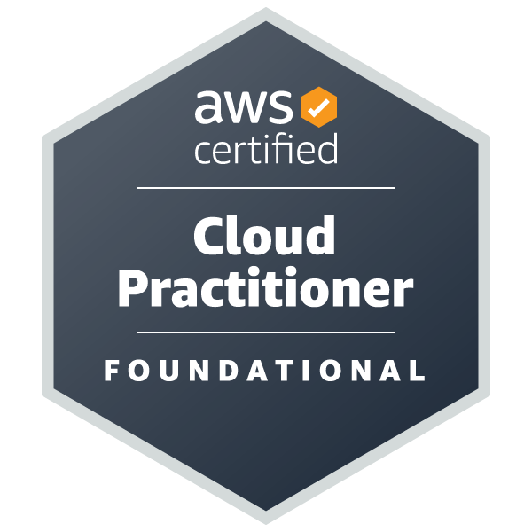

## Hi there 👋
Designer-turned-engineer based in Bahrain. I build software, break hardware, and glue both together until something useful happens.

## What I do
- Cloud / DevOps
- Care a lot about systems, automation, and performance

## Current focus
- DevOps & cloud engineering
- Go backend systems
- Infrastructure, containers, CI/CD

## Certifications (for now)

  

---

> I like building things that are slightly too complex for their own good.

<!--
**el7ommed/el7ommed** is a ✨ _special_ ✨ repository because its `README.md` (this file) appears on your GitHub profile.

Here are some ideas to get you started:

- 🔭 I’m currently working on ...
- 🌱 I’m currently learning ...
- 👯 I’m looking to collaborate on ...
- 🤔 I’m looking for help with ...
- 💬 Ask me about ...
- 📫 How to reach me: ...
- 😄 Pronouns: ...
- ⚡ Fun fact: ...
-->
